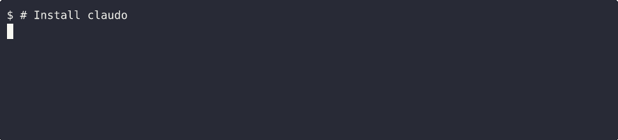

# claudo

**claudo** = **claud**e in **do**cker

Run Claude Code inside a Docker container for isolation, mounting the current
directory for easy access to your project.

The idea: It is so effective to run claude with `--dangerously-skip-permissions`, but also dangerous. Claude might go wild and [delete your home directory](https://www.reddit.com/r/ClaudeAI/comments/1pgxckk/claude_cli_deleted_my_entire_home_directory_wiped/).
It might be attacked by a prompt injection.

To develop with claude code, I would usually setup a devcontainer environment to isolate the project - but in quick and dirty cases where I just need AI help with filesystem access, I would not bother to do the 2 minute setup. I just want a quick command like `claude` on the CLI which gives me the AI powers.

`claudo` does that, by running `claude --dangerously-skip-permissions` in a docker container.

At its core `claudo` is a shortcut for (with a few more additional features, see below):

```bash
docker run -it --rm --hostname claudo -v $HOME/.claude:/home/claudo/.claude -v $PWD:/workspaces/$(basename $PWD) -w /workspaces/$(basename $PWD) ghcr.io/gregmuellegger/claudo:latest claude --dangerously-skip-permissions
```



## Features

- Mounts the current directory into `/workspaces/`
- Mounts `~/.claude` for authentication persistence (no re-login required)
- Docker-in-Docker support (`--dind`)
- Git config mounting for commits inside container (`--git`)
- Named persistent containers (`-n`)
- Security hardening with `--no-sudo` or `--no-privileges`
- Isolated mode without directory mount (`--tmp`)
- Custom image support (`-i` or `$CLAUDO_IMAGE`)

## Security Considerations

- **`~/.claude` is mounted read-write** for authentication persistence. Code running in the container can modify Claude's configuration and credentials.
- **`--dind` grants host root equivalent access.** The Docker socket allows full control of the host via Docker. Only use when you trust the code running inside.

The default image used is `ghcr.io/gregmuellegger/claudo:latest`. It is based on Ubuntu 24.04 with Claude Code pre-installed. Includes common dev tools: git, neovim, ripgrep, fd, fzf, jq, tmux, zsh (with oh-my-zsh), uv, and docker-cli.

The image is updated weekly to incorporate latest Ubuntu security patches.

## Installation

Requires Docker.

Install by placing the `claudo` script in your `~/.local/bin` directory. Make sure it is on `$PATH`.

```bash
curl -fsSL https://raw.githubusercontent.com/gregmuellegger/claudo/main/claudo -o ~/.local/bin/claudo && chmod +x ~/.local/bin/claudo
```

## Examples

```bash
claudo                        # run claude interactively
claudo -- zsh                 # open zsh shell
claudo -- claude --help       # run claude with args
echo "fix the bug" | claudo   # pipe prompt to claude
claudo --dind                 # enable docker commands inside container
claudo --dind -- docker ps    # run docker ps inside container
```

## Usage

<!--[[[cog
import cog
import subprocess
result = subprocess.run(['./claudo', '--help'], capture_output=True, text=True)
cog.outl('```')
cog.out(result.stdout)
cog.outl('```')
]]]-->
```
claudo - Run Claude Code in a Docker container

Usage: claudo [OPTIONS] [--] [COMMAND...]

Options:
  -e KEY=VALUE    Set environment variable in container (can be used multiple times)
  -i, --image IMG Use specified Docker image (default: $CLAUDO_IMAGE or built-in)
  --host          Use host network mode
  --no-sudo       Disable sudo (adds no-new-privileges restriction)
  --no-privileges Drop all capabilities (most restrictive)
  --dind          Mount Docker socket for Docker-in-Docker commands
  --git           Mount git config (~/.gitconfig and credentials) for committing
  -n, --name NAME Create a named container 'claudo-NAME' that persists after exit
  --tmp           Run isolated (no directory mount, workdir /workspaces/tmp)
  -v, --verbose   Display docker command before executing
  -h, --help      Show this help message

Arguments after -- are passed directly as the container command.

Examples:
  claudo                          Run claude --dangerously-skip-permissions (default)
  claudo -e API_KEY=xxx           Start with environment variable
  claudo -i claudo-base:latest    Use a different image
  claudo --host                   Start with host networking
  claudo --no-sudo                Start without sudo privileges
  claudo --no-privileges          Start with all caps dropped
  claudo --dind                   Enable docker commands from inside container
  claudo --git                    Enable git commits from inside container
  claudo -n myproject             Start named persistent container
  claudo -- claude --help         Run claude with arguments
  claudo -n dev -e DEBUG=1 -- claude
                                  Combined options with command

The current directory is mounted at /workspaces/<dirname>.
~/.claude is mounted for authentication persistence.
```
<!--[[[end]]]-->
